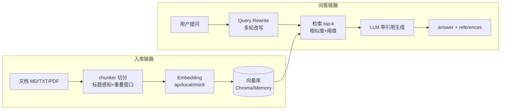
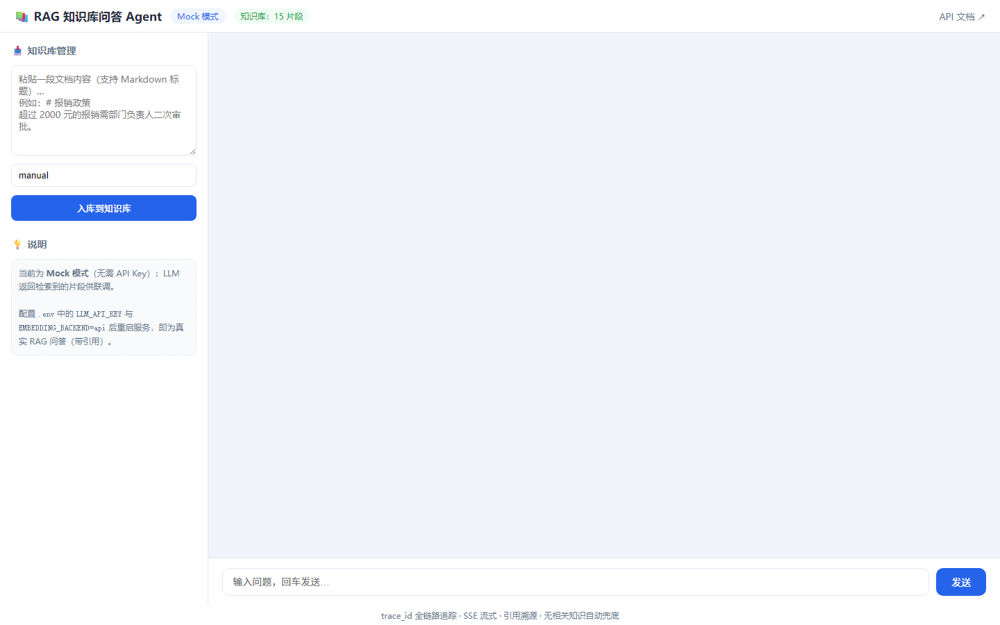

# RAG 企业知识库问答 Agent

[](https://github.com/20041018wzz-alt/rag-knowledge-agent/actions/workflows/ci.yml)
[](LICENSE)
[](pyproject.toml)

基于 **RAG（Retrieval-Augmented Generation）** 的企业知识库问答系统：文档自动切分向量化入库，用户提问时先检索相关片段、再由 LLM 带引用作答。支持 **SSE 流式输出、多轮追问改写、引用溯源、无相关知识兜底**，**无 API Key / 无 GPU 也能完整跑通（Mock 降级）**，内置 **golden set 评测** 与 **Docker 一键部署**。

## ✨ 特性

- 📄 **文档入库管线**：Markdown/TXT（可选 PDF）→ 标题感知 + 重叠窗口切分 → Embedding 向量化 → 向量库
- 💬 **Web 聊天界面**：浏览器即用，流式状态展示、引用来源折叠查看、在线加知识
- 🔍 **检索增强问答**：Query Rewrite 多轮改写 → 余弦相似度 top-k → LLM 带 `[n]` 引用生成
- 🛡️ **防幻觉设计**：相关性阈值护栏（低于阈值明确回复"知识库中没有相关信息"）+ 引用溯源可验证
- 🔌 **三档 Embedding**：OpenAI 兼容 API / 本地 BGE / Mock，工厂选择 + 失败自动降级
- 🗄️ **向量库抽象**：Chroma（可选）与纯 Python 内存实现（JSON 持久化）双后端，线程安全
- 📡 **FastAPI 服务**：`/api/chat`、`/chat/stream`（SSE）、`/api/ingest` 在线加知识、`/health`，自动 OpenAPI 文档
- 🧪 **可评测**：golden set 召回率/准确率评估脚本 + 25 个 pytest（全离线）
- 🐳 **生产部署**：Dockerfile（非 root + HEALTHCHECK）+ docker-compose 持久化

## 🏗️ 架构



## 🚀 快速开始（Mock 模式，零配置）

```bash
cd rag-knowledge-agent
pip install -r requirements.txt

# 1. 入库示例文档
python ingest.py --dir examples

# 2. 命令行问答
python agent.py --ask "报销超过多少钱需要二次审批？"
python agent.py --ask "公司食堂几点开门？"   # 无相关知识 → 明确兜底

# 3. 启动 Web 服务 → 浏览器打开 http://127.0.0.1:8000 使用聊天界面
python chat_service.py
```

## 📸 界面预览



左侧粘贴文档入库，右侧多轮问答：SSE 流式状态、回答引用来源可折叠查看、知识库外问题自动兜底。

## 🔧 配置真实模型（可选）

复制 `.env.example` 为 `.env` 并填写：

```ini
# LLM：DeepSeek 等 OpenAI 兼容服务
LLM_API_KEY=sk-xxx
LLM_BASE_URL=https://api.deepseek.com
LLM_MODEL=deepseek-chat

# Embedding：api（SiliconFlow BGE）或 local（本地模型）
EMBEDDING_BACKEND=api
EMBEDDING_API_KEY=sk-xxx
EMBEDDING_API_URL=https://api.siliconflow.cn/v1/embeddings
EMBEDDING_API_MODEL=BAAI/bge-m3
```

配置后重新入库生效：`python ingest.py --clear && python ingest.py --dir examples`。

## 📚 API

| 方法 | 路径 | 说明 |
|---|---|---|
| GET | `/` | Web 聊天界面（流式状态 + 引用展示 + 在线入库） |
| POST | `/api/chat` | 普通问答，返回 `{answer, references, sources, has_knowledge}` |
| POST | `/chat/stream` | SSE 流式：阶段状态（分析/改写/检索/生成）+ 最终回答 |
| POST | `/api/ingest` | 在线加知识：`{text, source}` |
| GET | `/api/knowledge` | 知识库片段数 |
| GET | `/health` | 健康检查（Docker HEALTHCHECK 使用） |

接口文档：启动后访问 `/docs`（Swagger UI）。

## 🧪 测试与评测

```bash
# 单元/接口测试（25 个，全离线）
python -m pytest tests -v

# golden set 评测（召回率 / 准确率）
python evaluate.py
```

示例评测结果（mock embedding，`examples/golden_set.json` 5 条）：

```
召回率 Recall@4: 5/5 = 100.00%
回答准确率: 未统计（Mock 模式；配置 LLM_API_KEY 后自动统计）
```

## 🐳 Docker 部署

```bash
cp .env.example .env          # 按需配置
docker compose up -d --build  # http://localhost:8000/docs
```

- 镜像：`python:3.12-slim`，非 root 运行，内置 HEALTHCHECK
- 数据卷：`./data` 持久化知识库索引（重建容器不丢数据）
- 生产建议：前置 Nginx/网关做 TLS 与限流；多实例时挂载共享数据卷（或换 Chroma/Milvus）

## 📁 项目结构

```
rag-knowledge-agent/
├── config.py            # 配置（环境变量，见 .env.example）
├── chunker.py           # 文档切分：标题感知 + 段落聚合 + 重叠窗口
├── embeddings.py        # Embedding 抽象：api / local / mock + 工厂
├── vector_store.py      # 向量库抽象：Chroma / Memory（线程安全 + JSON 持久化）
├── ingest.py            # 入库管线（CLI：--dir/--file/--clear）
├── retriever.py         # 检索 + Query Rewrite + 相关性阈值
├── agent.py             # RAG Agent：引用溯源 / 无知识兜底 / LLM Mock
├── chat_service.py      # FastAPI 服务（CORS / 全局异常 / trace_id 日志）
├── evaluate.py          # golden set 评测（召回率 / 准确率）
├── examples/            # 示例知识文档 + golden set
├── tests/               # 25 个 pytest（单元 + 接口）
├── Dockerfile           # 生产镜像（非 root + HEALTHCHECK）
├── docker-compose.yml   # 一键部署（数据卷持久化）
└── .github/workflows/   # CI：三平台 × 三 Python 版本跑测试
```

## 🗺️ Roadmap

- [ ] Rerank 重排（交叉编码器精排，提升 top-k 精度）
- [ ] 混合检索（BM25 + 向量，RRF 融合）
- [ ] Parent-child chunk（检索小块、回复用大块）
- [ ] 在线评测面板（golden set 指标可视化）
- [ ] 多租户知识库隔离与权限控制
- [ ] LLM token 级流式输出

## 📄 License

[MIT](LICENSE) © 2026 Wang Zhizun
